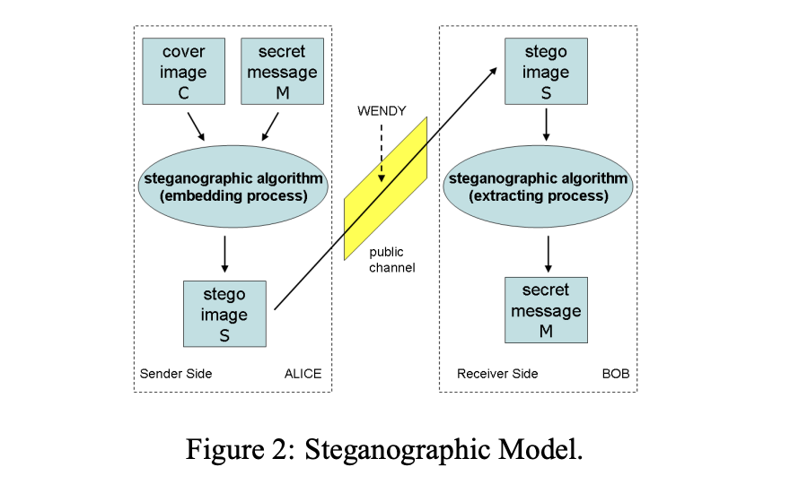
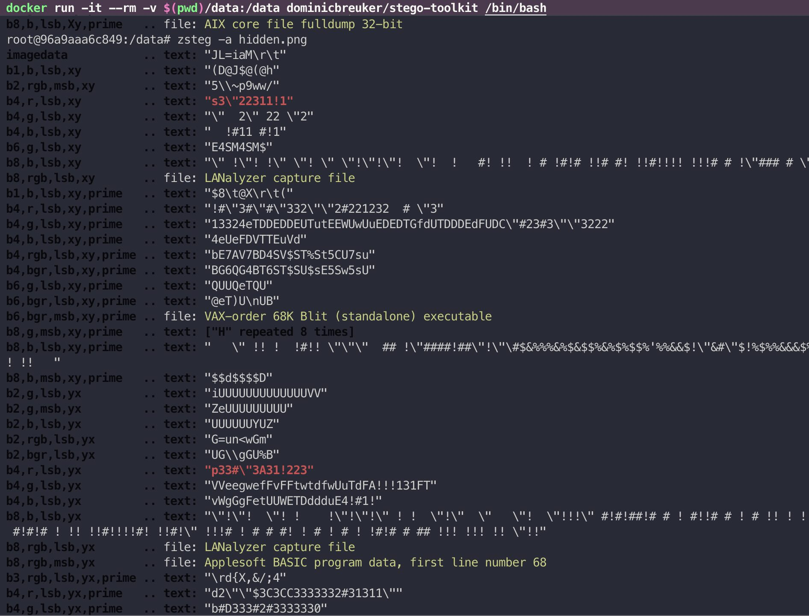

# Pentimento
> In painting, a [pentimento](https://en.wikipedia.org/wiki/Pentimento) (italian) is "the presence or emergence of earlier images, forms, or strokes that have been changed and painted over"

TLDR:
Its a tool to hide text inside images.

This project aims to delve into the field of image steganography, researching and implementing various techniques using Golang. The purpose is solely to practice Golang, with a focus on bitwise operations, encryption, and error correction.

## Demo results
<table>
  <tr>
    <td valign="top"><b>Original Image</b><br>
        <a href="assets/original.png">
            
        </a>
    </td>
    <td valign="top"><b>Image with 212 Kb of hidden text</b><br>
        <a href="assets/hidden.png">
            
        </a>
    </td>
  </tr>
</table>

## How to use (for now)

Encode
```
go run main.go encode original.png secrets.txt
```

Decode
```
go run main.go decode hidden.png
```

Test fit size
```
go run main.go fit original.png
```

## What is steganography?


## LSB - basic technique used for steanography
>
The Least Significant Bit (LSB) is a method used in digital steganography for hiding information within a digital file, such as an image or audio file.

In the context of an image, each pixel is represented by a binary number. The "least significant bit" is the last bit in this binary representation. The LSB method works by replacing these least significant bits with the bits from the data that needs to be hidden.

Because the least significant bit has the smallest impact on the overall value, changing it usually results in a minor alteration to the pixel's color. This change is typically so small that it's imperceptible to the human eye, making LSB a popular method for hiding information within images.


## Useful papers 


### [Highly Secured Hybrid Image Steganography with an Improved Key](https://dergipark.org.tr/tr/download/article-file/2475349)
Generation and Exchange for One-Time-Pad Encryption Method


Summary from the paper
```
Discrete Haar Wavelet Transform (DHWT)

One-Time-Pad (OTP) Encryption

Highly Secured Information Exchange Algorithm (HSIEA)

Least Significant Bit (LSB) Method

Optimal Pixel Adjustment Process (OPAP)

Discrete Cosine Transform (DCT)
```


### [IMAGE BASED STEGANOGRAPHY AND CRYPTOGRAPHY](https://www.diag.uniroma1.it/~bloisi/steganography/isc.pdf)


They propose a new method for integrating cryptography and steganography, which they call ISC (Image-based Steganography and Cryptography). 

It uses images as cover objects for steganography and as keys for cryptography. 

It's designed to work with bit streams scattered over multiple images or with still images. The method yields random outputs to make steganalysis more difficult and can cipher the message in a theoretically secure manner while preserving the stego image's statistical properties.


### [The Art of Data Hiding with Reed-Solomon Error Correcting Codes](https://arxiv.org/abs/1411.4790)


Basically this paper discusses the use of Reed-Solomon error correcting codes in steganography, which is the art of hiding information in a way that is not detectable to the naked eye. The authors propose a design that substitutes redundant Reed-Solomon codes with the steganographic message. 

### [Embedding in Two Least Significant Bits with Wet Paper Coding](https://eprint.iacr.org/2008/255.pdf)


Ideas from the paper:

LSB Matching Revisited (LSBMR): This scheme improves the security of LSB matching by reducing the number of changes made to the cover image, making it harder for steganalytic tools to detect hidden messages.

Enhanced LSBMR (ELSBMR): This scheme further improves the security of LSBMR by using a pseudorandom number generator to determine the locations of the pixels to be changed, making it even more difficult for steganalytic tools to detect hidden messages.

Double-layered Embedding (DLE): This scheme uses two different embedding rates for different parts of the image, improving the security of the hidden message by making it harder to detect with steganalytic tools.

### Steganography Toolkits
https://www.blackhatethicalhacking.com/tools/steganography-toolkits/
```
docker run -it --rm -v $(pwd)/data:/data dominicbreuker/stego-toolkit /bin/bash
zsteg -a out.png
```
Simple LSB zsteg detects 100% 

After our custom LSB hashing algo zsteg shows garbage
